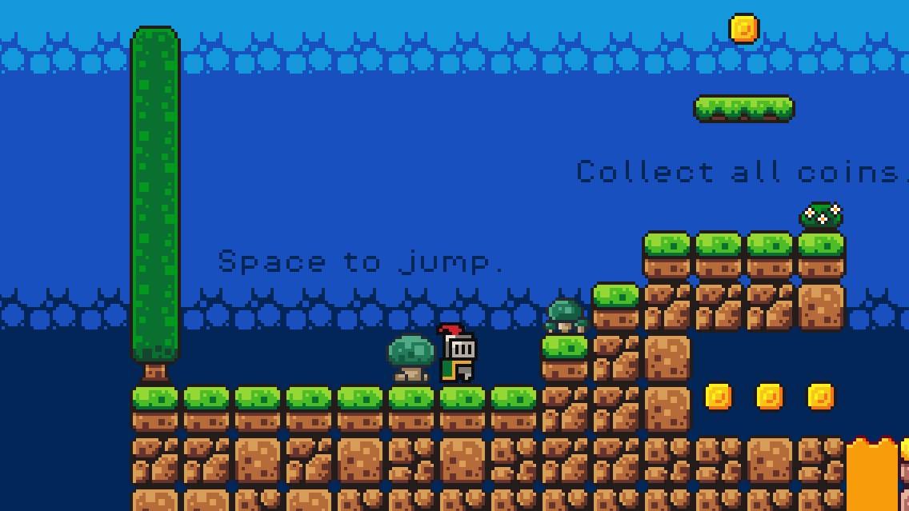

## ABOUT

This repository contains a simple 2D game developed using the Godot Engine, with already available assets and following a guide. It's a platformer where you avoid falling and collect coins.

  

## TOPICS I LEARNED

- Understand the structure of scenes and how nodes are organized.
- Learn about physics simulation and collision detection in 2D games.
- Explore creating tile-based maps and using tilesets for level design.
- Create sprite animations and frame-based movement.
- Implement player controls and add enemy behavior using GDScript.
- Understand the different types of physics bodies.
- Add sound effects and background music with loops and autoloads.
- Use signals for communication between nodes and manage time-based events.
- Handle player input and respond to events using GDScript.
- Control the camera view and manage world boundaries.
- Implement informational labels and restart conditions.

## REQUIREMENTS

- [How to make a Video Game - Godot Beginner Tutorial](https://youtu.be/LOhfqjmasi0?si=FOhDy-tuMkdaqCuv) `YouTube`
- [Brackeys' Platformer Bundle](https://brackeysgames.itch.io/brackeys-platformer-bundle) `Website`
- [Godot Engine](https://godotengine.org/) `Website`

> [!NOTE] 
> The assets are released under a **Creative Commons Zero (CC0)** license. You can distribute, remix, adapt, and build upon the material in any medium or format, even for commercial purposes. Attribution is not required.

## EXPORT

1. Open Godot Engine and load the project `project.godot` file;
2. Go to `Project` > `Export...`;
3. Click on `Add...` and select the platform you want to export the game;
4. Configure the export settings;
5. Click on `Export Project...` and select the folder where you want to export the game.
6. Play the game by running the executable file.

## CONTRIBUTING

If you find any issues or have suggestions for improvements, feel free to fork the repository and open an issue or submit a pull request.

## LICENSE

This project is licensed under The Unlicense License. See the [LICENSE](https://github.com/jotavare/godot-simple-game/blob/main/LICENSE) file for details.